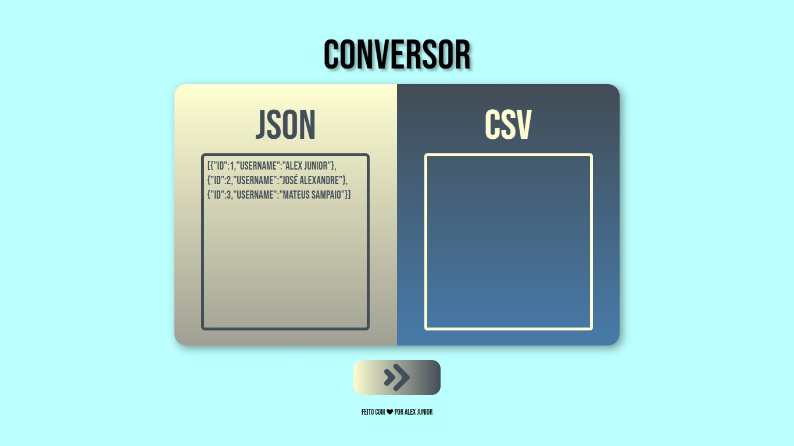

# JSON-TO-CSV

## Developers and end users are both experts in their own domains and as such, each speaks using a domain-specific language and terminology. This also extends to the tools used to manipulate data. Developers have found JSON to be a universally accepted method for transferring data between applications. End Users, on the other hand, rely on spreadsheets to organize and analyze data.

## The objective of JSON2CSV is to help bridge the gap between JSON and CSV by converting JSON to CSV to make it easier to review data in a spreadsheet. It allows the user to paste JSON into a text box to generate its equivalent CSV.

[👉 Click here see the project 👈](https://alexjr22.github.io/JSON-TO-CSV/)
